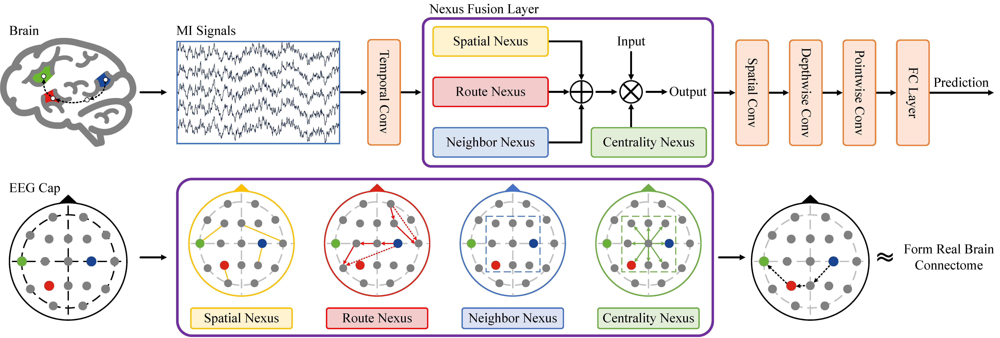

# NexusNet: Leveraging Nexuses in Graph Neural Network for Enhanced Motor Imagery Decoding

*Core code will be made available upon acceptance.*

This is a PyTorch implementation of NexusNet for MI decoding.

### Abstract
- We propose a lightweight GNN, NexusNet, designed to
capture complex relationships beyond pairwise connections.

- We conduct thorough experiments on two public datasets
to validate NexusNet. Specifically, it achieves an average
accuracy of 79.31% (hold-out) on the BCIC-IV-2a dataset and 87.70% (hold-out)
on the BCIC-IV-2b dataset.

- We visualize the primary Nexuses to quantitatively analyze
the relationships reconstructed by NexusNet. This visualization
enables a detailed examination of how different
Nexuses contribute to the decoding process.

### Requirements

Please refer to [requirements.txt](./req.txt)

### Model Zoos

Pretrained checkpoints are available in
- [bciciv2a_checkpoint](./bciciv2a_checkpoint/)
- [bciciv2b_checkpoint](./bciciv2b_checkpoint/)

### License

This project is licensed under the MIT License - see the [LICENSE](./LICENSE) file for details.
